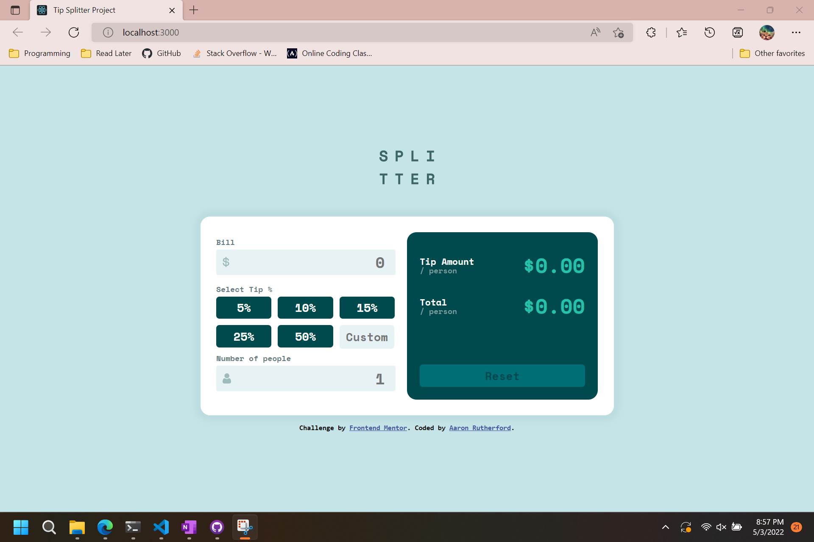

# Frontend Mentor - Tip calculator app solution

This is a solution to the [Tip calculator app challenge on Frontend Mentor](https://www.frontendmentor.io/challenges/tip-calculator-app-ugJNGbJUX). Frontend Mentor challenges help you improve your coding skills by building realistic projects.

## Table of contents

- [Overview](#overview)
  - [The challenge](#the-challenge)
  - [Screenshot](#screenshot)
  - [Links](#links)
- [My process](#my-process)
  - [Built with](#built-with)
  - [What I learned](#what-i-learned)
  - [Continued development](#continued-development)
  - [Useful resources](#useful-resources)
- [Author](#author)

## Overview

### The challenge

Users should be able to:

- View the optimal layout for the app depending on their device's screen size
- See hover states for all interactive elements on the page
- Calculate the correct tip and total cost of the bill per person

### Screenshot

### Links

- Solution URL: [Add solution URL here](https://your-solution-url.com)
- Live Site URL: [Add live site URL here](https://your-live-site-url.com)

## My process

### Built with

- Flexbox
- CSS Grid
- [React](https://reactjs.org/) - JS library

### What I learned

I learned a lot during this project, as this was the first project I've ever done with not only React, but JavaScript. The biggest learning curve was understanding how to structure the app. First going in, I tried building everything inside App.js as one big component. It didn't go well.

I also learned alot about props and how to pass state from the parent component into the children component via props.

I also learned how to customize styles based on a state value.

### Continued development

I want to continue focusing on React apps. React seems incredibly powerful and I want to make larger, more intricate apps. Plus, I have a lot to learn.

### Useful resources

- [Sitepoint React Calculator Tutorial](https://www.sitepoint.com/react-tutorial-build-calculator-app/) - This helped me understand how to structure a react application. It also showed me what a wireframe was. This was very helpful for planning out my own program.

## Author

- Frontend Mentor - [@Hazipan](https://www.frontendmentor.io/profile/Hazipan)
- GitHub - [Hazipan](https://github.com/Hazipan)